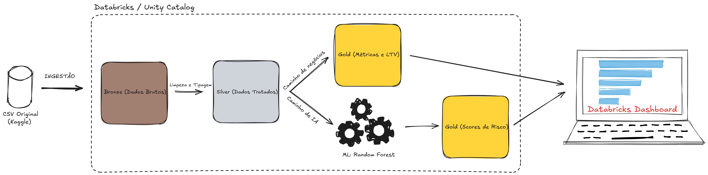
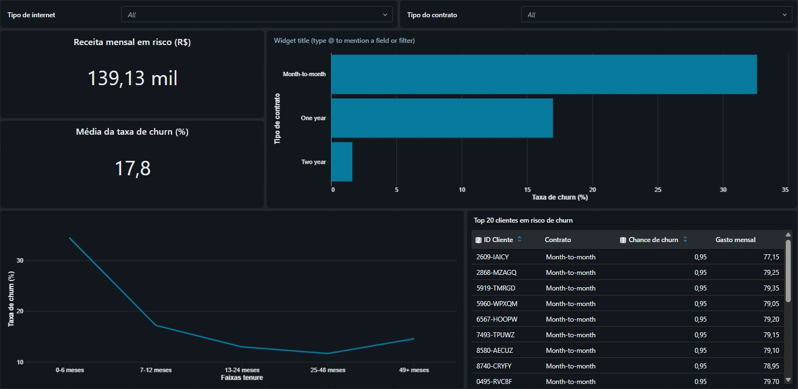

# PROJETO: Previsão de Churn e Priorização de Retenção

### **📌 O Problema de Negócio** ###

A empresa enfrenta uma alta taxa de cancelamento (churn) de clientes, impulsionada principalmente pela evasão nos contratos mensais, o que compromete a previsibilidade de receita. O desafio é identificar antecipadamente os assinantes com maior probabilidade de saída, permitindo que a equipe de atendimento priorize ações de retenção focadas naqueles de maior impacto financeiro.  
  
  
### **🏗️ Arquitetura Medalhão** ###

O fluxo de dados foi desenhado utilizando o conceito de Lakehouse, processando o dado desde a ingestão bruta até o consumo final e inferência do modelo de Machine Learning.

### **📊 Dashboard Final** ###   

  
### **🎯 Resultados Alcançados** ###
A análise descritiva e a modelagem preditiva trouxeram os seguintes resultados consolidados:

Descobertas de Retenção: Identificamos que o tipo de contrato é o fator mais sensível para o cancelamento. A taxa de churn no contrato mensal é de 42,7%, caindo drasticamente para 11,2% nos contratos de 1 ano e apenas 2,8% nos contratos de 2 anos.

Performance do Modelo: O algoritmo de Random Forest atingiu um AUC de 0.8363, provando ser altamente capaz de distinguir clientes fiéis daqueles com intenção de cancelamento.

Impacto Acionável: Geração automatizada de uma lista com os Top 20 clientes de maior risco, cruzando a probabilidade matemática de churn (> 60%) com a receita mensal. Isso permite à equipe de retenção proteger a receita de forma cirúrgica e priorizada.

### **🧠 Principais Aprendizados** ###
Modelagem orientada a negócios: O verdadeiro valor da Ciência de Dados não está em prever o churn por si só, mas em cruzar essa probabilidade com dados financeiros (mensalidade/LTV) para gerar insights acionáveis (quem a equipe deve ligar primeiro).

A união de SQL, Spark e Pandas: A arquitetura Lakehouse brilhou ao permitir o uso da melhor ferramenta para cada etapa no mesmo ambiente. Tratamento pesado em Spark SQL e inferência do modelo no Scikit-learn via Pandas.

Gerenciamento de Experimentos: O uso do MLflow simplifica absurdamente o ciclo de vida do Machine Learning. Ter parâmetros, métricas e o próprio modelo salvos automaticamente evita a perda de histórico de testes.

DataOps e Automação: Orquestrar os notebooks utilizando o Databricks Workflows demonstrou que a engenharia vai além do código; é necessário construir pipelines que dependam uns dos outros (Bronze -> Silver -> Gold -> ML) para garantir uma execução autônoma e segura em produção.

**📂 Conjunto de Dados**  
Os dados brutos utilizados para este projeto baseiam-se no tradicional dataset Telco Customer Churn.

Link original: [Telco Customer Churn (Kaggle)](https://www.kaggle.com/datasets/blastchar/telco-customer-churn)
